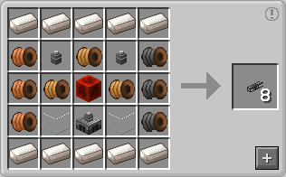

# Cable

Cable is a block from [Refined Storage](../../mods/refinedstorage.md) that connects network elements in loaded chunks

## Crafting

Needed:  
- [ Quartz Enriched Iron](./quartz_enriched_iron.md) ·10  
- 3· HV Wire Coil  
- 3· LV Wire Coil  
- 3· MV Wire Coil  
- 2· Clear Glass  
- 2· Refined Relay  
- Block of Redstone  
- Refined Transformer