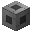

# Controller

The heart of your network. You can have only one Controller per [Refined Storage](../../mods/refinedstorage.md) network.

## Crafting

  
Crafting Shape: 7·7  
Required Pedestal: 48  
Required Crafting Core: 1 - [ Machine Casing](./machine_casing.md)

Needed:  
- 8· HV Wire Coil  
- 4· Advanced Catalyst  
- 4· Advanced Tier Installer  
- 4· Basic Tier Installer  
- 4· Elite Bin  
- [ Quartz Enriched Iron Block](./quartz_enriched_iron_block.md) ·4  
- 2· Industrial Machine Chassis  
- 2· Double-Layer Capacitor  
- 4· Elite Tier Installer  
- 2· Glowstone Ingot  
- 2· Mana Diamond  
- 2· Manasteel Ingot  
- 2· Nether Star  
- 2· Refined Obsidian Ingot  
- Enhanced Machine Chassis  
- Simple Machine Chassis